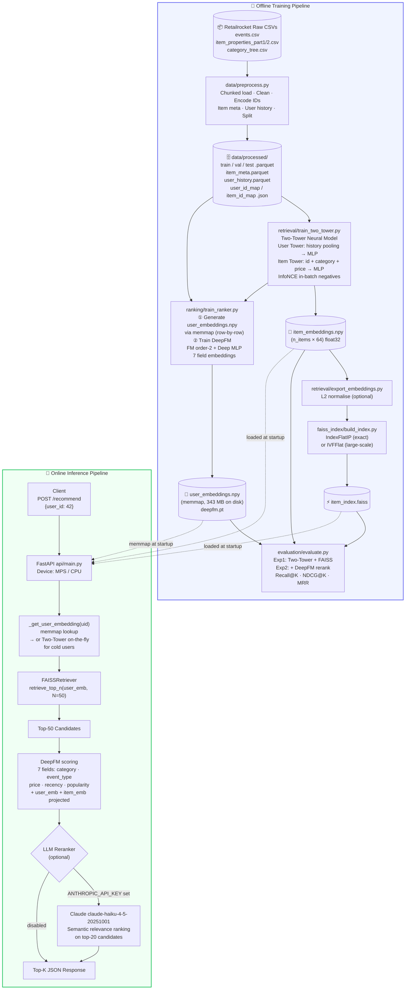

```mermaid
flowchart TD
    subgraph OFFLINE["🔧 Offline Training Pipeline"]
        direction TB
        A[("📦 Retailrocket Raw CSVs\nevents.csv\nitem_properties_part1/2.csv\ncategory_tree.csv")] --> B["data/preprocess.py\nChunked load · Clean · Encode IDs\nItem meta · User history · Split"]

        B --> C[("🗄️ data/processed/\ntrain / val / test .parquet\nitem_meta.parquet\nuser_history.parquet\nuser_id_map / item_id_map .json")]

        C --> D["retrieval/train_two_tower.py\nTwo-Tower Neural Model\nUser Tower: history pooling → MLP\nItem Tower: id + category + price → MLP\nInfoNCE in-batch negatives"]

        D --> E[("📐 item_embeddings.npy\n(n_items × 64) float32")]

        E --> F["retrieval/export_embeddings.py\nL2 normalise (optional)"]
        F --> G["faiss_index/build_index.py\nIndexFlatIP (exact)\nor IVFFlat (large-scale)"]
        G --> H[("⚡ item_index.faiss")]

        D --> I["ranking/train_ranker.py\n① Generate user_embeddings.npy\n   via memmap (row-by-row)\n② Train DeepFM\n   FM order-2 + Deep MLP\n   7 field embeddings"]

        C --> I
        I --> J[("🎯 user_embeddings.npy\n(memmap, 343 MB on disk)\ndeepfm.pt")]

        J --> K["evaluation/evaluate.py\nExp1: Two-Tower + FAISS\nExp2: + DeepFM rerank\nRecall@K · NDCG@K · MRR"]
        H --> K
        E --> K
    end

    subgraph ONLINE["🚀 Online Inference Pipeline"]
        direction TB
        L["Client\nPOST /recommend\n{user_id: 42}"] --> M["FastAPI api/main.py\nDevice: MPS / CPU"]

        M --> N["_get_user_embedding(uid)\nmemmap lookup\n→ or Two-Tower on-the-fly\n   for cold users"]

        N --> O["FAISSRetriever\nretrieve_top_n(user_emb, N=50)"]
        O --> P["Top-50 Candidates"]

        P --> Q["DeepFM scoring\n7 fields: category · event_type\nprice · recency · popularity\n+ user_emb + item_emb projected"]

        Q --> R{"LLM Reranker\n(optional)"}
        R -->|"ANTHROPIC_API_KEY set"| S["Claude claude-haiku-4-5-20251001\nSemantic relevance ranking\non top-20 candidates"]
        R -->|"disabled"| T["Top-K JSON Response"]
        S --> T
    end

    H -.->|"loaded at startup"| M
    E -.->|"loaded at startup"| M
    J -.->|"memmap at startup"| M

    style OFFLINE fill:#f0f4ff,stroke:#6366f1,stroke-width:2px
    style ONLINE  fill:#f0fff4,stroke:#22c55e,stroke-width:2px
```
